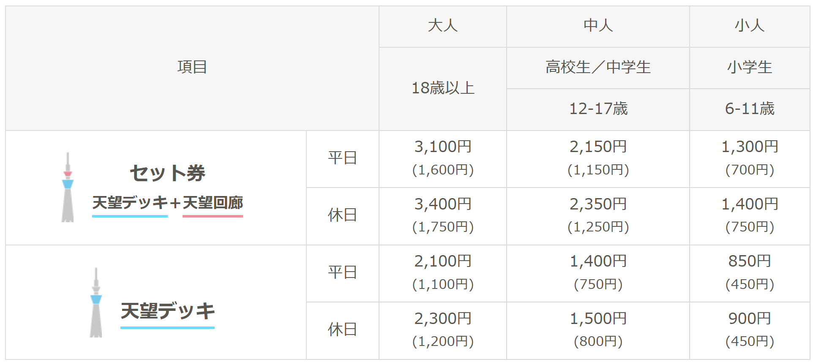

# 交通方式

## 东京-富士山

## 富士山-京都

## 京都-大阪-奈良

# 主要旅行景点

## 东京都与周边

### 上野区域

#### &#9642; 東京国立博物館

<b>开放时间</b>： 
周一：闭馆； 
周二、周三、周四、周日：9:30 am - 5:00 pm； 
周五、周六：9:30 am - 8:00 pm； 
<b>注</b>：关于节假日的开馆日程详见<a href="https://www.tnm.jp/modules/r_free_page/index.php?id=113" class="custom-link-1">东京国立博物馆 - 参观指南</a>。 

<b>门票</b>： 

¥1000 成人  
¥500 大学生  
¥0 青少年 (<17岁)、老年人 (>79岁)、中小学生 
¥0 残疾人士及其陪同者 

<b>导览</b>： 
<a href="https://www.tnm.jp/pdf/guide/TokyoNationalMuseumMapandGuide_zh_cn.pdf" class="custom-link-1">中文导览图</a>； 
<a href="https://www.tnm.jp/pdf/guide/TokyoNationalMuseumMapandGuide_en.pdf" class="custom-link-1">英文导览图</a>； 
<a href="https://www.tnm.jp/modules/r_free_page/index.php?id=2069" class="custom-link-1">App</a>； 

<b>预计游览时间</b>：2小时。

地址：13-9 Uenokoen, Taito City, Tokyo 110-8712日本； 
电话：+81 5055418600； 
网站：<a href="https://www.tnm.jp/" class="custom-link-1">东京国立博物馆</a>。

  <iframe src="https://www.google.com/maps/embed?pb=!1m18!1m12!1m3!1d25917.536443985195!2d139.7652571970477!3d35.709194893850935!2m3!1f0!2f0!3f0!3m2!1i1024!2i768!4f13.1!3m3!1m2!1s0x60188e8314d77d11%3A0x232fd618bd4977dd!2z5Lic5Lqs5Zu956uL5Y2a54mp6aaG!5e0!3m2!1szh-CN!2sus!4v1744935784446!5m2!1szh-CN!2sus" width="600" height="450" style="border:0;" allowfullscreen="" loading="lazy" referrerpolicy="no-referrer-when-downgrade"></iframe>

  <a href="https://maps.app.goo.gl/8oGaiRxm59hMfK118" target="_blank" class="map-card-link">
    

      
    

    

      
东京国立博物馆

      
13-9 Uenokoen, Taito City, Tokyo 110-8712日本

    

  </a>

<!-- 国立西洋美術館 -->
#### &#9642; 国立西洋美術館

<b>开放时间</b>： 
周一：闭馆； 
周二、周三、周四、周日：9:30 am - 5:00 pm； 
周五、周六：9:30 am - 8:00 pm； 

<b>门票</b>：  

¥500 成人  
¥250 大学生  
¥0 青少年 (<17岁)、老年人 (>79岁)、中小学生 
¥0 残疾人士及其陪同者 

<b>导览</b>： 

<a href="https://www.nmwa.go.jp/zh/visit/floorplans.html" class="custom-link-1">导览图</a>； 

<b>预计游览时间</b>：2小时。

地址：7-7 Uenokoen, Taito City, Tokyo 110-0007日本； 
电话：+81 5055418600； 
网站：<a href="https://www.tnm.jp/" class="custom-link-1">国立西洋美术馆</a>。

  <iframe src="https://www.google.com/maps/embed?pb=!1m18!1m12!1m3!1d25917.536443985195!2d139.7652571970477!3d35.709194893850935!2m3!1f0!2f0!3f0!3m2!1i1024!2i768!4f13.1!3m3!1m2!1s0x60188e9cfa41cc7f%3A0xbb23dcd494e13c8b!2z5Zu956uL6KW_5rSL576O5pyv6aaG!5e0!3m2!1szh-CN!2sus!4v1744937464050!5m2!1szh-CN!2sus" width="600" height="450" style="border:0;" allowfullscreen="" loading="lazy" referrerpolicy="no-referrer-when-downgrade"></iframe>

  <a href="https://maps.app.goo.gl/8oGaiRxm59hMfK118" target="_blank" class="map-card-link">
    

      
    

    

      
东京国立博物馆

      
13-9 Uenokoen, Taito City, Tokyo 110-8712日本

    

  </a>

<!-- 上野公園 -->

#### &#9642; 上野公園

<b>开放时间</b>：全天开放 
<b>门票</b>：免费 
<b>预计游览时间</b>：1小时。 

<!-- 浅草寺 -->

#### &#9642; 浅草寺

<b>开放时间</b>：全天开放 
<b>门票</b>：免费 
<b>预计游览时间</b>：1小时。 

地址：2 Chome-3-1 Asakusa, Taito City, Tokyo 111-0032日本； 
电话：+81 3-3842-0181； 
网站：<a href="https://www.senso-ji.jp/" class="custom-link-1">浅草寺</a>。

  <iframe src="https://www.google.com/maps/embed?pb=!1m18!1m12!1m3!1d22216.121071428857!2d139.77024190550253!3d35.70721659713324!2m3!1f0!2f0!3f0!3m2!1i1024!2i768!4f13.1!3m3!1m2!1s0x60188ec1a4463df1%3A0x6c0d289a8292810d!2z5rWF6I2J5a-6!5e0!3m2!1szh-CN!2sus!4v1744937909203!5m2!1szh-CN!2sus" width="600" height="450" style="border:0;" allowfullscreen="" loading="lazy" referrerpolicy="no-referrer-when-downgrade"></iframe>

  <a href="https://maps.app.goo.gl/pPNqj48kgoJktxJZA" target="_blank" class="map-card-link">
    

      
    

    

      
东京国立博物馆

      
13-9 Uenokoen, Taito City, Tokyo 110-8712日本

    

  </a>

<!-- 东京天空树 -->

#### &#9642; 东京天空树

<b>开放时间</b>： 
周一-周五：10:00 am - 10:00 pm； 
周六-周日：9:00 am - 10:00 pm； 
<b>注</b>：最晚入场时间为9:00 pm。 ·

<b>门票</b>：详见下图 
<!-- include a figure -->
<figure>
  
  <figcaption>东京天空树票价</figcaption>
</figure>

  <iframe src="https://www.google.com/maps/embed?pb=!1m18!1m12!1m3!1d39584.03950465002!2d139.74110742335426!3d35.70582921557903!2m3!1f0!2f0!3f0!3m2!1i1024!2i768!4f13.1!3m3!1m2!1s0x60188ed0d12f9adf%3A0x7d1d4fb31f43f72a!2z5Lic5Lqs5aSp56m65qCR!5e0!3m2!1szh-CN!2sus!4v1744939405810!5m2!1szh-CN!2sus" width="600" height="450" style="border:0;" allowfullscreen="" loading="lazy" referrerpolicy="no-referrer-when-downgrade"></iframe>

  <a href="https://maps.app.goo.gl/5yPBaF9uQtDtj6uc7" target="_blank" class="map-card-link">
    

      
    

    

      
东京国立博物馆

      
13-9 Uenokoen, Taito City, Tokyo 110-8712日本

    

  </a>

